<!-- ─────────────────────────────────────────────────────────────────────
     CONTRIBUTION HEATMAP  –  auto-refreshed daily via GitHub Actions
     ───────────────────────────────────────────────────────────────────── -->

<h3><code>atul@github ~ $ ./contributions.sh</code></h3>

  

<!-- ─────────────────────────────────────────────────────────────────────
     WHOAMI  ·  stats + neofetch info card
     ───────────────────────────────────────────────────────────────────── -->

<h3><code>atul@github ~ $ whoami</code></h3>

<table>
  <tr>
    <td valign="top" width="360">
      
    </td>
    <td valign="top" width="500">
      
    </td>
  </tr>
</table>

 

<!-- ─────────────────────────────────────────────────────────────────────
     CONNECT
     ───────────────────────────────────────────────────────────────────── -->

<h3><code>atul@github ~ $ cat ./connect.txt</code></h3>

  
  
  
  

 

<!-- ─────────────────────────────────────────────────────────────────────
     TECH STACK
     ───────────────────────────────────────────────────────────────────── -->

<h3><code>atul@github ~ $ neofetch --stack</code></h3>

  
  
  
  
  
  
  
  
  
  
  
  
  
  
  
  
  
  
  

 

<!-- ─────────────────────────────────────────────────────────────────────
     GITHUB STATS
     ───────────────────────────────────────────────────────────────────── -->

<h3><code>atul@github ~ $ git stats</code></h3>

  
  

 

<!-- ─────────────────────────────────────────────────────────────────────
     VISITOR COUNTER
     ───────────────────────────────────────────────────────────────────── -->

  

🤖 Heatmap auto-refreshes daily via <a href="./.github/workflows/update-profile-art.yml">GitHub Actions</a> · self-hosted Python scripts · no third-party token required

